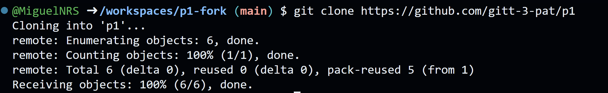
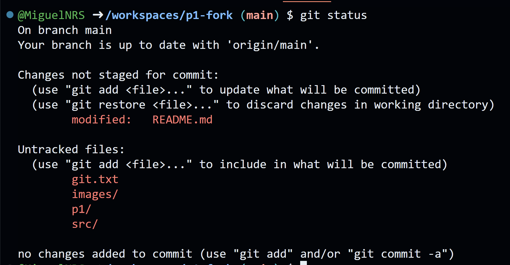
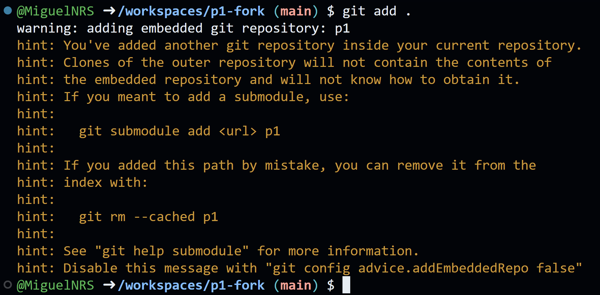

# Práctica 1

Un repositorio para empezar a usar [git](https://git-scm.com/) y Github

## ¿Como probar en la nube?

[Github-Codespaces](https://github.com/features/codespaces)

## Comandos git básicos

```
git clone https://github.com/gitt-3-pat/p1
git status
git add .
git commit -m "TU MENSAJE"
git push

git checkout -b feature/1
git checkout main
```

## ¿Cómo escribir un README.md con formato?

[Github Markdown](https://docs.github.com/es/get-started/writing-on-github/getting-started-with-writing-and-formatting-on-github/basic-writing-and-formatting-syntax)

# Memoria de la practica
## Clone
El comando git clone copia un repositorio remoto en tu local, la salida por consola al comando es la siguiente:


## Status
El comando git status te dice el estado actual del repositorio es decir lo que esta cambiado y lo que esta pendiente de guardar en git, la salida por consola al comando es la siguiente:


## add
El git comando add . añade todos los cambios hechos en el repositorio en local y los deja listos para un commit, la salida por consola al comando es la sigueinte:
