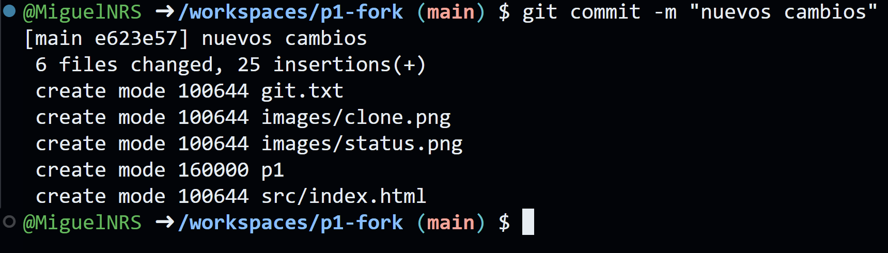
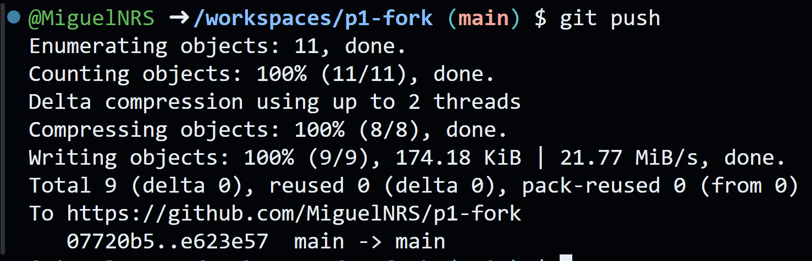
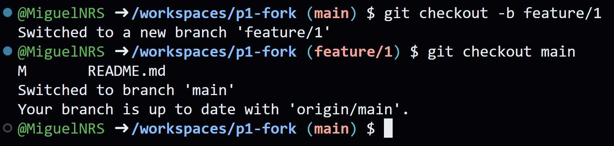
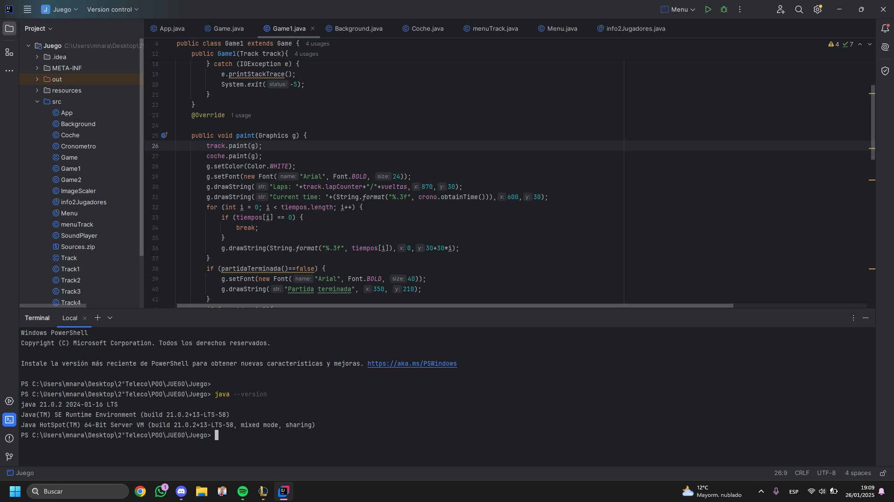

# Práctica 1

Un repositorio para empezar a usar [git](https://git-scm.com/) y Github

## ¿Como probar en la nube?

[Github-Codespaces](https://github.com/features/codespaces)

## Comandos git básicos

```
git clone https://github.com/gitt-3-pat/p1
git status
git add .
git commit -m "TU MENSAJE"
git push

git checkout -b feature/1
git checkout main
```

## ¿Cómo escribir un README.md con formato?

[Github Markdown](https://docs.github.com/es/get-started/writing-on-github/getting-started-with-writing-and-formatting-on-github/basic-writing-and-formatting-syntax)

# Memoria de la practica
## Clone

El comando git clone copia un repositorio remoto en tu local, la salida por consola al comando es la siguiente:


## Status

El comando git status te dice el estado actual del repositorio es decir lo que esta cambiado y lo que esta pendiente de guardar en git, la salida por consola al comando es la siguiente:


## add

El git comando add . añade todos los cambios hechos en el repositorio en local y los deja listos para un commit, la salida por consola al comando es la sigueinte:


## Commit

El comando git commit -m "mensaje" crea como un checkpoint al que puedes volver dentro de git y prepara los cambios para subirlos, la salida por consola al comando es la siguiente:



## Push

El comando git push sube al repositorio remoto los cambios guardados en el anterior commit, la salida por consola al comando es la siguiente:



## Checkout

El comando checkout se usa para cambiar entre una y otra rama del git usadas para desarrollar de forma paralela, primero se pide el comando git checkout -b el cual crea una rama nueva y te lleva a ella y depues git checkout main el cual te trae de nuevo a la rama main, sus salidas por consola son las siguientes:



## Conclusión
En esta práctica hemos aprendido a manejarnos con los comandos basicos del git para el control de las versiones en el desarrollo de software a traves de ejecutar los comandos basicos en un code space del repositorio fork de la práctica 1. 
Primero hemos hecho un fork y un clone para tener una copia del repositorio en nuestro repositorio local. Despues hemos visto el estado de nuestro repositorio, añadido todos los archivos para un commit, hecho el commit y lo hemos subido a el repositorio remoto. Por ultimo hemos creado una nueva rama y vuelto a hacer checkout a nuestra rama main.

# Entorno java
Esta es una captura de intellij donde se puede ver la version de jdk intalada
